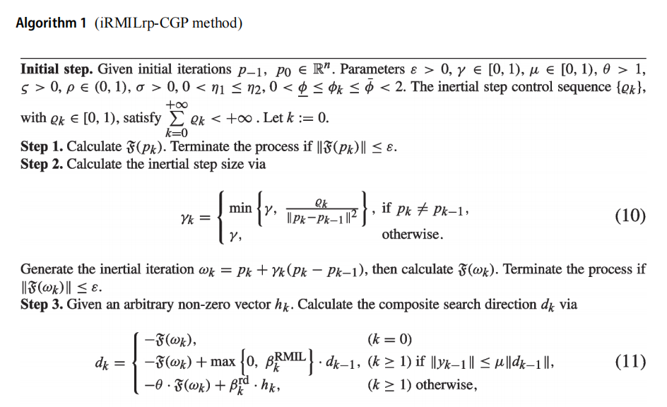








My name is Fan Jiaxu. I am currently pursuing a Master of Philosophy in Computer and Information Engineering at The Chinese University of Hong Kong, Shenzhen, where I conduct research at the Network Coding Laboratory (NCLab). Jointly supervised by Yang Shenghao and Chen Yi, my core research focuses on Multi-Agent Reinforcement Learning and Information Coding.  

Prior to this, I earned a Bachelor of Science in Mathematics from China University of Mining and Technology (CUMT). Under the guidance of Shao Hu, my undergraduate research centered on Optimization Algorithms and their applications in Intelligent Transportation.  

Beyond my core research, I have a keen interest in complex networks, queuing theory, and LLM reasoning—exploring these to expand my interdisciplinary perspective. Outside academia, I enjoy watching films, which helps me unwind, gain cultural insights, and inspire creativity.  

Detailed academic background, project experiences, and research explorations are available on my homepage.

# 🔥 News
- *2022.02*: &nbsp;🎉🎉 Lorem ipsum dolor sit amet, consectetur adipiscing elit. Vivamus ornare aliquet ipsum, ac tempus justo dapibus sit amet. 
- *2022.02*: &nbsp;🎉🎉 Lorem ipsum dolor sit amet, consectetur adipiscing elit. Vivamus ornare aliquet ipsum, ac tempus justo dapibus sit amet. 

# 📝 Publications 

Netw. Spatial Econ., Nov 2024

[An Inertial-type CG Projection Method with Restart for Pseudo-monotone Costs with Application to Traffic Assignment]

Pengjie Liu; Linhao Li; Hu Shao; Meixing Liu;**Jiaxu Fan**

- We introduce the iRMILrp-CGP method with restart procedure and self-adaptive line search for solving nonlinear equation systems (SoNE), prove its global convergence for continuous pseudo-monotone costs (no Lipschitz continuity needed), validate its efficiency via SoNE experiments, and show its practicality in traffic assignment. 

# 🎖 Honors and Awards
- *Aug. 2025*, Academic Exploration Award in The Chinese University of Hong Kong, Shenzhen
- *Jan. 2025*, Bronze Medal in The 2024 University Physics Competition 
- *Dec. 2023*, First-Class Scholarship of CUMT & Outstanding Student of CUMT 
- *Dec. 2024*, Second-Class Scholarship of CUMT & Outstanding Student of the School of Mathematics
- *June 2024*, First Prize of the May 1st Mathematical Modeling Contest in Jiangsu Province 
- *Jan. 2024*, Special Prize in the Red Special Category of the Challenge Cup

# 📖 Educations
- *2026.09 - Now*, Master of Philosophy, Computer and Information Engineering, The Chinese University of Hong Kong, Shenzhen, China.
- *2022.09 - 2026.06*, Bachelor of Mathematics and Applied Mathematics, China University of Mining and Technology, Xuzhou, China. 

# 💬 Academic Exchange
- *2025.09*, Hong Kong Baptist University(HKBU), Academic Seminar on Key Node Identification in Complex Networks.
- *2025.07*, The Chinese University of Hong Kong, Shenzhen, 2025 Elite Undergraduate Summer Camp, Completed the courses: Introduction to Machine Learning, Explainable Artificial Intelligence (XAI), and Mathematical Principles of Artificial Intelligence.
- *2024.07*, Nanyang Technological University (NTU), CS2400 Foundation of Information Analytics.

# 💻 Internships
- *July 2025 - Aug. 2025*, Summer Research, The Chinese University of Hong Kong, Shenzhen.
- *Feb. 2025 - May 2025*, Intern Math Teacher, Xuzhou No.1 Middle School, China
- *Jan. 2025 - Feb. 2025*, Technical Assistant Intern, Industrial and Commercial Bank of China (ICBC), China
